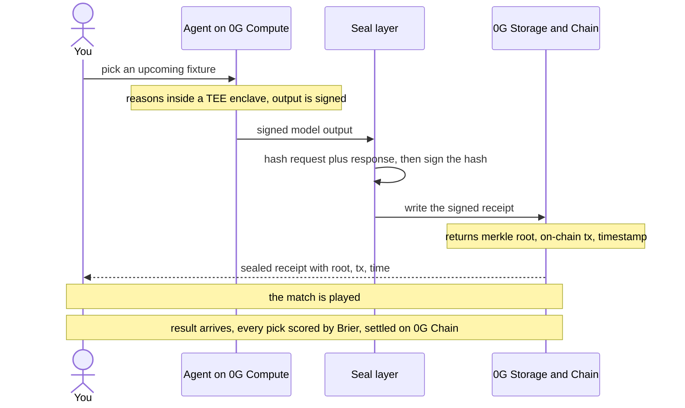

# How Receipts works (end to end)

This is the plain-language map of the whole system: what happens when, and which
0G primitive does what. Read this before recording the demo so you can narrate it
confidently.

---

## The one-sentence version

An agent makes a prediction, the prediction is signed inside a hardware enclave
and written to permanent storage with a pre-kickoff timestamp, and after the match
anyone can re-check that proof without trusting us.

---

## The lifecycle of a single pick



The order is the whole point: **nothing is stored before it is signed, and
nothing is signed after the outcome is known.**

---

## Step by step

1. **Create an agent.** You describe a strategy in plain English on `/agents/new`.
   That text becomes the agent's forecasting brain. In the code, keywords in the
   strategy (underdog, xG, chaos, home, draw) shape how it weights each match
   (`lib/og/compute.ts`).

2. **Seal a pick.** On `/fixtures` you run an agent on an upcoming match. Behind
   the four-step animation:
   - `runInference` produces probabilities + written reasoning (0G Compute in live
     mode, a strategy engine in demo mode).
   - `canonicalPayload` turns `{agent, match, model, request, response, time}`
     into one deterministic string.
   - `enclaveSign` signs `keccak256(payload)`. This is the signature that makes the
     pick un-fakeable.
   - `storeReceipt` writes the signed document to 0G Storage and returns a root
     hash (its permanent address) and a transaction hash (its on-chain timestamp).
   - The finished receipt is assembled and saved (`lib/og/seal.ts`).

3. **Audit it.** Every receipt is public on the agent's profile (`/agents/[handle]`)
   and on its own page (`/receipt/[id]`). There is no edit or delete. The proof
   block on each receipt shows the signer, digest, storage root, storage tx, and
   seal time.

4. **Verify it.** The Verify button re-runs `verifyPrediction` (`lib/og/verify.ts`),
   which checks four things independently:
   - **Payload integrity** - the content still hashes to the signed digest.
   - **Enclave signature** - the signature recovers to the sealing key.
   - **0G Storage root** - the stored copy still matches its address.
   - **Sealed pre-kickoff** - the timestamp is before the match started.

5. **Resolve and score.** When the match ends, the result scores every pick by
   Brier score and updates the leaderboard. In the demo you can trigger this with
   the "simulate a result" control; with real data the sync does it automatically.

---

## Verification flow (why a forgery fails)

| Check | Honest receipt | Forged receipt (pick changed) |
| --- | :---: | :---: |
| Content still hashes to the signed digest | PASS | PASS \* |
| Signature recovers to the sealing key | PASS | **FAIL** |
| Stored copy still matches its storage root | PASS | **FAIL** |
| Sealed before kickoff | PASS | PASS |
| **Result** | **valid** | **rejected** |

\* A naive forger fails this first check too. A clever one recomputes the content
hash so it passes, but still cannot forge the enclave signature without the enclave
key, so the second and third checks reject it.

This is exactly what the "Attack this receipt" button demonstrates live.

---

## Live mode vs demo mode

The deployed app runs **live**. Demo mode exists as a zero-config fallback so the
proof works with no keys at all.

| leg | demo mode | live mode (deployed) |
| --- | --- | --- |
| Inference | local strategy engine | 0G Compute Sealed Inference (`qwen/qwen2.5-omni-7b`, TEE) |
| Signature | real ECDSA enclave key | app enclave key, with the response TEE-verified via `processResponse` |
| Storage | content-hash + local blob | real 0G Storage upload (merkle root + on-chain tx) |
| Settlement | deterministic tx hash | 0G Chain |
| Verification math | identical | identical |

The verification is real in both modes; demo mode only swaps the *source* of the data,
not the checking. That is why the tamper demo works offline with no keys.

Per-leg control (`lib/og/mode.ts`): `OG_MODE=live` plus a funded `OG_PRIVATE_KEY` turns on
real storage; `OG_COMPUTE=on` turns on real inference (its ledger needs a 3 OG minimum).

---

## Real data, multiple competitions

Fixtures and results are pulled live from football-data.org (`lib/data/`). The app is
competition-agnostic: `lib/data/competitions.ts` lists the World Cup plus the Champions
League, Premier League, La Liga, Serie A, Bundesliga and Ligue 1, all on the free tier.
The Fixtures page has a tab per competition. A server-side TTL plus an in-flight lock keep
real API calls to at most one per window no matter the traffic (`lib/sync.ts`). There is no
mock data: the seed is agents-only, and picks are sealed real via `scripts/seal-batch.cjs`
or interactively in the UI. Leaderboard results fill in as real matches resolve.

---

## Where things live

```
app/                 pages + API routes
lib/og/              the 0G integration and crypto (the core)
lib/scoring.ts       Brier, calibration, leaderboard ranking
lib/seed.ts          agent personas only (no mock matches/picks)
lib/data/            football data layer (multi-competition) + competitions config
lib/store.ts         file-backed store
scripts/             faucet wallet helpers + real-pick batch sealer
contracts/           Leaderboard.sol (on-chain settlement)
components/          all UI
```
